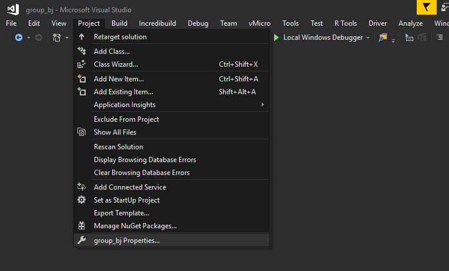
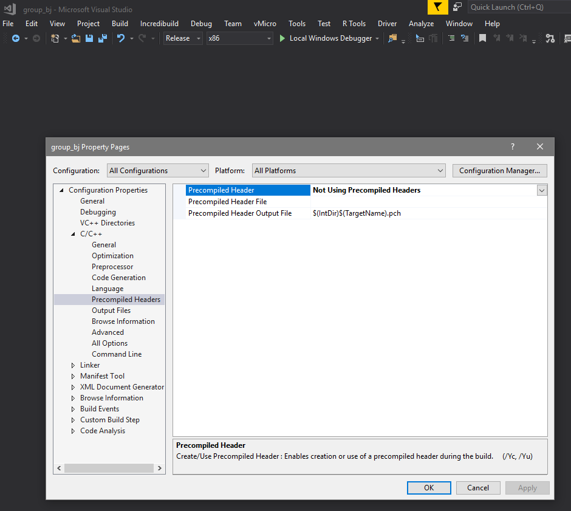

# cpp_group_project

Final project for cit-1813. A copule of notes before starting:

1. We're not using Pre-Compiled headers. There's a good reason for this, and it's mostly because it's not widely used in the industry, and you shouldn't get used to having it. Also, *because* it's not widely used in the industry, you should get used to the steps required to remove it from a project. It's pretty straightfoward.
  a. Open the project solution in Visual Studio Community
  b. Go to group_bj -> Properties (see screenshot below) 
  c. From there go to Configuration Properties -> C/C++ -> Precompiled Headers, and change it from "yes" to "no" and remove "pch.h" if it's in the second line, there. (see screenshot below) 
  d. Once you've done that, click "apply" and close the window, then come back to the main file, group_bj.cpp and hit [F5] to save, compile, build, and test-run the project. If you did everything correctly, it should run. If not, find me on Slack, and we'll try to figure out what you did wrong.

## A quick write-up on using git

First, you need an account with github. If you don't have one, you should go make one right now. If you ever plan on doing code for school, your career, or just for whatever, really... git will be your best friend. But first, let's get some basic nomenclature and concepts down.

### What's the difference between git and github?

git is just FOSS (Free and Open Source Software), no different than other FOSS programs you may have used before, like:

1. [Firefox](https://www.mozilla.org/en-US/firefox/new/)
2. [GIMP](https://www.gimp.org/downloads/)
3. [Audacity](https://www.audacityteam.org/download/)
4. [LibreOffice](https://www.libreoffice.org/download/download/)
5. [Notepad++](https://notepad-plus-plus.org/download/v7.6.6.html)

git is a bit different than other FOSS programs you've probably used before in that it's a very unique program that solves a very specific problem for programmers. Its primary job is to allow you to save different versions of your code, and collaborate with other programmers.

Think of git like the way your video game save system works. You know how in Skyrim, you can create as many saves as you want, and you can go back to any previous save, as far back as you like? Imagine doing that with your code. You're at a good "save point," with your code, and you want to try something kinda risky that might not work, or might even break the whole thing? That's okay. Save what you got and try it. Worst case scenario, load your last save (in git, we call a "save point" a "commit") or even load a commit from even earlier than that, and try something else. That's what git does for your code, and it's a life saver! It also allows multiple people to work on the same project, without interferring with each other's code (more on that later).

Now, in order for this system to work, we need 2 things. We need a server running git, hosting the git repo (short for "repository"), and a git client (i.e. a developer's PC) where the developer works on the code separately from the code on the server. We call the code that's been downloaded to the developer's PC the "local" branch. When the developer reaches a good place to stop or "save" their code, they "commit" their recent changes, and if their code is ready to join the rest of the code (i.e. everything's woking, nothing's broken or crashing), the developer will use git to "push" their code to the *server* where their code "merges" with the code on the server. We call code that lives on the server the "remote" branch, and I'll be using these terms a lot later on, so get used to these terms.

### Okay, so what's github, then?

Github is a company that hosts git servers (remember, git is open source software. Nobody "owns" git), and created a simple, easy-to-use web interface for git (which otherwise would NOT be a thing), making it more accessible and easier to use than traditional git (which works over the command-line only). On top of that, they still maintain all the functionality of "traditional" git, so power users can still do everything they normally do with git. Everybody wins.

### How do I use git?

Normally, I'd advise people to get used to git on Linux before trying it on Windows, but obviously, for this group project, time is short, and we don't have that kind of luxury, so I'll be providing a crash course on it in this doc. For this, I'm assuming we're all on the same page, in terms of what OS and software we're using:

1. We're all using Visual Studio 2017 or later (as required by class), and by extension, this means:
2. We're all using Windows of some kind, whether that's Win10, Win8/Win8.1, or Win7. If you're running anything older than Win7, talk to me, and we'll figure it out.
3. You have downloaded git for windows already.
  a. If you haven't yet, get it from [here](https://git-scm.com/download/win)
  b. It's been too long since I downloaded and installed git for Windows to tell you in this doc how to set it up, so all I can say is hit me up on Slack, and I'll try to walk you through the installation. In fact, I'm going to setup a specific channel in Slack for this very thing. That way, if someone else wants to try it, and I'm not available, they can look through the conversation history, see any screenshots left behind in the conversation, and maybe they can walk through it themselves. If not, come find me. I'll get you setup.
4. Once you have git installed and setup, the next step is to open git BASH from your Windows Start Menu. Hit the [WIN] Key, and type "BASH" and you should see "git BASH" filter to the top of the list. Hit [ENTER] to open it up. You should see a simple CLI (Command Line Interface), just like you'd see in Linux or DOS. 
5. You should note that this step is optional, but it'll help you keep everything organized and easier to find in git. Once you got git BASH up and running, let's make a new directory called "git_repos" where we'll store all of your git repos. Do that by entering a command.

Before we get to that, let me go over some basic CLI syntax. In a lot of tutorials you'll find online (for instance, Stack Overflow), you'll see something like this, if someone was giving you an example of how to use the "ls" command in the terminal:

```bash
$ ls
```

You're probably wondering why there's a "\$" in front of the "ls" command, right? If you look at a Linux Terminal (or even the git BASH terminal you have open now), you'll notice your prompt begins with a "$" right? This character has a meaning, and there's another character, "#" that has a different meaning, and we use these in terminal syntax explanations for clarity. The "#" character means you're performing this command "as root" in Linux (or Administrator, if you're in Windows). If you're using the "\$" that means you're doing it as your regular user. For something like "ls" we don't necessarily need to be "root" or "Administrator" therefore we don't use the "#" character, we use "\$"

Long story short, any commands I'm showing you like the above will begin with either a "#" or a "$" and you shouldn't copy those into the terminal. But everything that comes *after* that character should be entered into the terminal **exactly** as you see it. That said, let's get back to the git tutorial.

6. So you have git BASH open, and we want to make our git_repos directory. From wherever you opened the terminal, let's make sure we're where we want to be. Enter the following into the terminal:

```bash
$ cd ~
```

The "Tilde" character (~) is found by pressing [SHIFT] and the key to the left of the [1] key on your keyboard (right above [TAB]).

7. From there, let's create the git_repos dir:

```bash
$ mkdir git_repos
```

If it worked, it won't say anything, it'll just do it and give you a new prompt. If you type:

```bash
$ ls -la
```

You should see the dir you just created sitting there. Let's "Change Directory" into it:

```bash
$ cd git_repos
```

This is a good time to mention that the [TAB] key can be used to auto-complete BASH commands. If you type:

```bash
$ cd ..
```

This will take you one level up back to where you were. You can get away with simply typing:

```bash
$ cd git
```
and instead of hitting [ENTER], hit [TAB], and you should see it auto-completes "_repos" at the end of your command. You should see:

```bash
$ cd git_repos
```

in your terminal. If not, I don't know how you got there, but you're in the wrong directory, and need to type:

```bash
$ cd ~
```

to get back to where you were, and try the previous command again. Either way, let's move on.

8. So let's get back into our git_repos directory (you remember how to do that, right? It was in Step 7, if you forgot), and "clone" our repo into the current directory. To do that, type:

```bash
$ git clone https://github.com/gregorthebigmac/cpp_group_project
```

First thing, is it will ask you for your github username and password. This only happens with "private" repos (which ours is). If this were a "public" repo, it would not ask you for your username and password, it would just work with no questions asked. With github, you can only make private repos if you pay for an account with them (yes, I have a paid account). It's not terribly expensive ($7/mo), and for someone like me, who writes a lot of code, and doesn't always want it exposed to the world, it's well worth the expense. Also, you can get like, I think 2 years or something free if you're a student, so if you need it, take advantage of it. Now, back to the task at hand. Once you've entered your credentials, it will begin downloading the repo into the git_repos directory, under a new directory named cpp_group_project. Now change into *that* directory, just like you did with git_repos earlier.

9. Now we're inside the actual git repo, itself. Just to do a quick check, use the following command to get the status of your repo:

    $ git status

This isn't *really* necessary, since we *just* downloaded it, but it's a good command to remember, and get familiar with what you *should* see when everything's good and normal. It should say something like "up to date with (master) branch, blah blah." Everything's good.

Now we're going to switch to the "playground" branch. We only commit to the "master" branch when we *know* 100% for certain that we have some good, solid, ready-to-showcase kind of code. This is not a git *rule,* per se, it's more of an industry practice (and a good one to get used to). The general hierarchy goes like this:
**Master** branch is what you release to the public. It's been thoroughly tested, and we know it works. This is what we also call the "release" version of our software, because it's ready to be "released" to the public.
**Dev** branch (sometimes also known as "devel," "develop," or "development" branch) is the primary branch of the repo that the developers will "commit" and "push" their code to when it's working *as far as they can tell.* This is an important distinction in the industry, where programmers don't do the most thorough testing. You have dedicated *testers* for that job, who then report bugs back to the developers, who then go chase down and fix those bugs. The dev branch is usually *mostly* stable, but *not quite* ready for prime-time.
**BugFix/[insert name here]** Is typically used for exactly that--Tracking down and fixing bugs. Different companies have different naming conventions for these kinds of branches, so for our purposes, we'll just stick with our names for this, but you will likely encounter companies which use the style of "**BugFix/Issue#[number]**" for their repos. An example of this could be a branch called "**BugFix/Issue#152_player_run_broken**" This means there's a specific ticket number associated with this bug (152), and the bug has something to do with the player's character having issues with running. Easy enough, right? So let's make our own branch! For now, we'll use our own name. My name is Kyle, so just replace anywhere you see "kyle" with your own name.

10. To create and switch to a new branch, use the following:

```bash
$ git checkout dev
Switched to a new branch 'dev'
Branch 'dev' set up to track remote branch 'dev' from 'origin'.

$ git checkout -b kyle dev
Switched to a new branch 'kyle'
```

This will switch your current working branch from "master" to "dev" and then creates a branch *from* dev with your name. If you looked at the files while you were in the "master" branch, and you look at the files now that you switched to your own branch, you may notice the files have changed. That's how it works. It literally swaps out files when you switch from one branch to another, that way you *cannot* mess with the files in another branch. It does this to stop you from accidentally screwing up another branch.

Now that you're in your own branch, you can do whatever you want with the code, with no fear of messing up anyone else's work. Now, since you just switched to your own branch, and you're all up to date with it, let's modify a file and do the whole "game save" (i.e. git commit) thing with it, and then push those files for some practice. Let's create a blank file called "test.txt". To do that, we'll use the BASH command "touch", which creates a blank file with a given name.

```bash
$ touch test.txt
```

That's it! We made a new file! If you use "ls" or "ls -la" you should see the new file you just made. Now, technically, that's all it takes to make enough of a difference that git will allow you to make a commit, so let's see what it says by running a "git status" command...

```bash
$ git status
On branch kyle
Untracked files:
  (use "git add <file..." to include in what will be committed)

        test.txt

nothing added to commit but untracked files present (use "git add" to track)
```

You should see a readout of what files you changed. The git equivalent of making a new game save that you can come back to later is called making a "git commit." This creates a unique save point within the repo and notes the changes you made this time. To create a git commit, type the following into the terminal:

```bash
$ git add *

$ git commit -m "my first git commit"
[kyle e02cb74] my first git commit
 2 files changed, 24 insertions(+), 6 deletions(-)
  create mode 100644 test.txt
```

Just know that your output won't match *exactly* what I have here, but it should look *pretty close.*

### What did I just do?

So the first part,

```bash
$ git commit
```

did exactly what we just said it would. The part in quotes is a brief description of what you did in the commit (except not this time.) Normally, you'd put something in there, like "Changed variable [xyz] to [abc] and changed function call to reflect that" or something short and descriptive like that to help you (and others on your team) figure out what this change was, and why it was important enough for you to commit it. The "-m" flag says I'm going to put my description in double-quotes right here and now, while the "-a" flag tells git to open up a text editor for you to manually type in your commit description, which it will do. For now, let's keep it simple, and just go with "-m" and type it right there. Now, if you did everything correctly, it should say something like the text above. If not, PM me, and we'll see what went wrong. 

Now we're ready to *push* our commit to the "remote branch" (which lives on github). Right now, you're working in the "local" branch, which lives on your machine, and you're *pushing* your changes into the "remote" branch (which lives on github). We do that with:

```bash
$ git push
```

This time, it will ask for your username and password *regardless* of whether or not this is a private or public repo. That's because not just anyone can push to a git repo. Even with public repos, you must have permission to push code to a repo. It's both a security and safety feature. You don't want random anonymous users pushing code into your repo, even if it's open source software.

Now let's say you made a mistake, or somehow broke your code, and you want to restore what you had before, and undo ALL of your changes since your last commit/push. This is pretty straightforward, even if the syntax seems a little weird.

```bash
$ git reset --hard HEAD
```

This will completely undo everything you did and put you back to the most recent commit/push you made. If it turns out your mistake is much worse than that, and you want to go back to an even *earlier* commit, that's a bit more involved, and is a bit too complicated for this simple write-up, so just IM me on slack if you find yourself in this situation, and we'll go through it together. But the commands I showed you here should be enough to get you by if you're working on your own repo. There's just one more command you need to know, and while on the surface, it seems easy and straightforward, it can cause some headaches, depending on the situation, so I'm only going to cover the easy part. If someone else on the team modified the remote branch (like you just did when you committed and pushed your code to the remote branch) and you want to get their changes on your local branch, you need to do a git pull:

    $ git pull

This will "pull" all the changes from the remote branch into your local branch. The reason this can get a bit hairy is when you've made changes on your local branch that haven't been committed and pushed to the remote branch. This can (and usually does) cause a conflict, which *can* be difficult to fix. Just IM me if that happens.